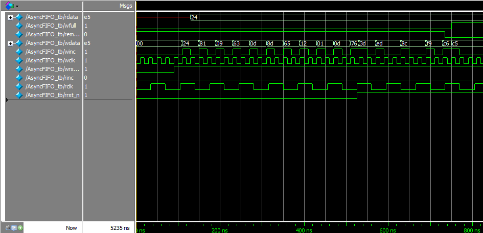

# Asynchronous FIFO

---

##  專案介紹
本專案實作一個 **非同步 FIFO（Asynchronous FIFO）**，用於兩個不同時域之間的資料傳輸。  
在數位系統中，若資料從一個時域傳送到另一個時域，可能會因為時序不一致而導致**亞穩態（metastability）**，進而造成系統不穩定或資料錯誤。  

為了避免此問題，本專案採用 **Gray Code（格雷碼）** 同步技術，確保在跨時脈同步過程中，每次只有一個位元變化，以降低metastability風險。  
同時，透過兩個雙級同步器使讀寫指標在不同時域之間能夠穩定傳遞。  

本專案 FIFO 的結構可參數化（包含data width、address、depth等），並具有 Full 與 Empty 偵測邏輯，可應用於以下情境：
- 不同頻率時脈間的資料交換（如 CPU 與周邊介面）  
- 高速資料緩衝    
- DMA、AXI bus 等需要跨時脈連接的設計

---

##  系統架構
整體架構如下：


Top-level 模組 `AsyncFIFO` 連接五個主要子模組：

| 模組名稱 | 功能說明 |
|-----------|-----------|
| `fifomem` | FIFO 的記憶體空間，用於存放資料 |
| `wptr_full` | 寫入端指標與是否寫滿的判斷 |
| `rptr_empty` | 讀出端指標與是否讀空的判斷 |
| `sync_r2w` | 將讀指標同步到寫入時域 |
| `sync_w2r` | 將寫指標同步到讀出時域 |

---

## 模組說明

### **Top-Level：`AsyncFIFO`**
整合所有子模組，負責連線與訊號同步。

- **`DSIZE`**：資料寬度（本專案設計為 8 bit）  
- **`ASIZE`**：位址寬度（本專案設計為 4 bit，depth = 2⁴ = 16）

### **1. `fifomem`**
雙埠記憶體(Dual Port RAM)，根據 `winc` 與 `raddr` 來控制記憶體的寫入/讀出資料，而depth 則由 `ADDRSIZE` 決定。

### **2. `wptr_full`**
管理 **寫入指標（write pointer）**，以 Gray Code 形式表示，並同時計算 FIFO 是否達到「Full」狀態。

Full 條件：
```verilog
wfull_val = (wgraynext == {~wq2_rptr[ADDRSIZE:ADDRSIZE - 1], wq2_rptr[ADDRSIZE - 2:0]});
```

當寫入指標的高兩位與同步過來的讀指標相反時，代表 FIFO 已滿。

### **3. `rptr_empty`**
管理 **讀出指標（read pointer）**，以 Gray Code 表示，並判斷 FIFO 是否為「Empty」狀態。

Empty 判斷條件：
```verilog
rempty_val = (rgraynext == rq2_wptr);
```

當下一個 Gray code 讀指標等於同步過來的寫指標時，代表 FIFO 為空。

### **4. `sync_r2w` / `sync_w2r`**
兩個雙級同步模組，除了用於跨時脈訊號穩定，還可以降低metastability影響的機率。

---

##  Testbench
  
主要功能：
- 建立雙時脈（本專案設計`wclk = 50MHz`, `rclk ≈ 14MHz`）
- 模擬非同步行為與重置信號
- 以隨機資料進行寫入與讀出
- 使用簡易 queue 驗證資料順序一致性

---

##  輸出結果

模擬過程中，Testbench 會在每次成功讀出資料後進行比對，  
當讀出的 `rdata` 與寫入時記錄的 `wdata` 完全相同時，終端機會顯示：  
Correct! expected wdata = XX, rdata = XX  

若有任何位元錯誤或不同步，則終端機會輸出：  
ERROR! Checking failed: expected wdata = XX, rdata = YY  


---

##  Simulation waveform

模擬結果如下圖所示，顯示非同步 FIFO 在不同時脈域下的寫入與讀出行為皆能正常運作。




---

##  Reference

Clifford E. Cummings, *Simulation and Synthesis Techniques for Asynchronous FIFO Design*

